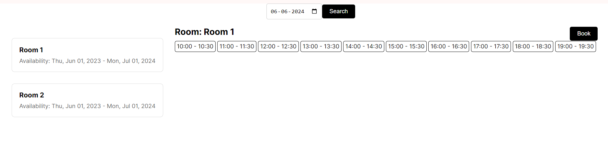
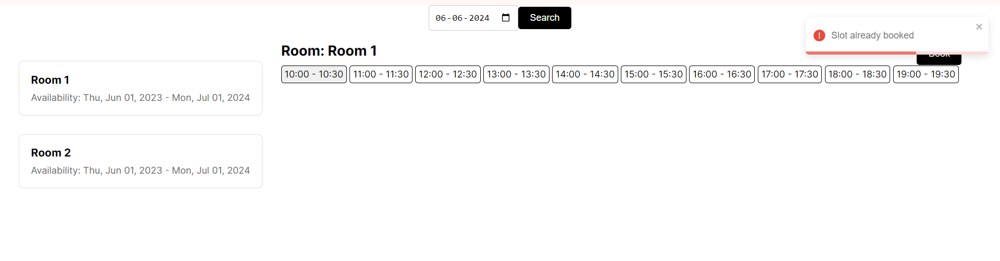
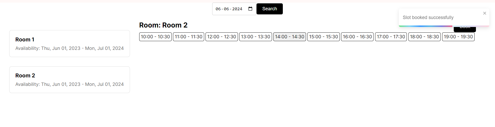
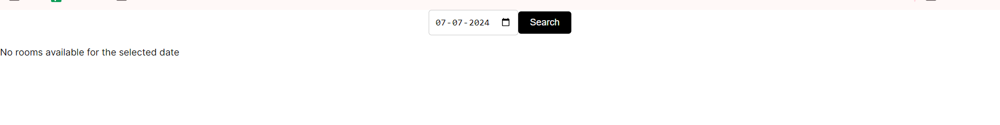

# Room Booking Application

This is a single-page application (SPA) built using Next.js for booking rooms. Users can search for available rooms based on selected dates, view room details, and book available time slots.

## Features

1. **Search Functionality**: Users can search for available rooms by selecting a date.

2. **Room List**: Displays a list of available rooms based on the selected date.

3. **Room Details**: Shows detailed information about the selected room, including availability and time slots.

4. **Book Slots**: Users can book available time slots for the selected room and date.

5. **Error Handling**: Displays error messages if there are issues with fetching data or booking slots.

6. **Responsive Design**: The application is responsive and works well on different screen sizes.

## Technologies Used

- **Next.js**: Frontend framework for building React applications.
- **React**: JavaScript library for building user interfaces.
- **MongoDB**: Database for storing room and booking data.
- **Express.js**: Backend framework for handling API requests.
- **react-toastify**: Library for displaying toast notifications.

## Installation

1. Clone the repository:

   ```bash
   git clone <repository-url>
   ```

2. Install dependencies:

   ```bash
   npm install
   ```

3. Start the development server:

   ```bash
   npm run dev
   ```

4. Open your browser and navigate to [http://localhost:3000](http://localhost:3000) to view the application.

## Output






## Contributing

Contributions are welcome! Please open an issue or submit a pull request if you find any bugs or have suggestions for improvements.

## License

This project is licensed under the [MIT License](LICENSE).